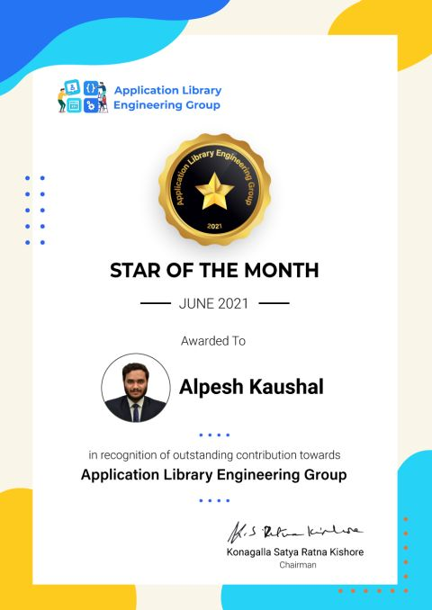
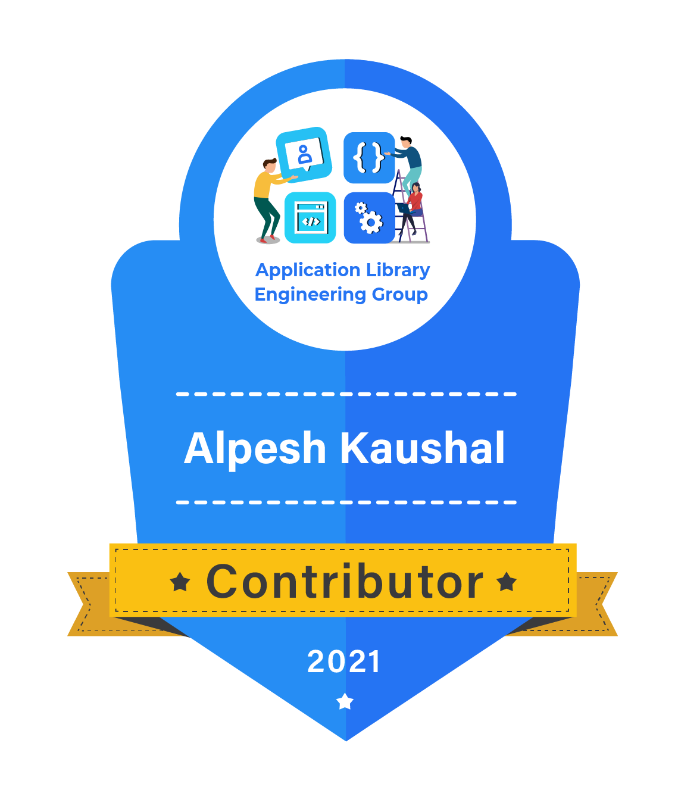

# Alpesh Kaushal

<!--  -->

## 👨‍💻 About Me

I am an experienced Backend Developer with a strong background in designing and implementing scalable, high-performance systems. My primary expertise lies in Go (Golang) and Java. I have consistently demonstrated success in both developing and leading software development projects. Additionally, I have contributed to the open-source community as well.

## 🎓 Education

**Indian Institute of Technology (IIT) Kharagpur**, Kharagpur, India
- Bachelors and Masters in Computer Science and Engineering (2017 - 2022)

## 🛠️ Skills

- **Languages:** Go (Proficient), Java (Proficient), C/C++ (Proficient), Python, JavaScript, PHP, HTML, XML
- **Frameworks and Tools:** Gin, GORM, Java Spring Boot, Docker, Prometheus, VictoriaMetrics, Grafana, AWS, Google Cloud Platform
- **Databases:** PostgreSQL
- **Other Technologies:** Shell Script, Beautiful Soup, Django, Selenium (Automation), Node.js
- **Coursework:** Data Structures and Algorithms, Object-Oriented Programming, Operating Systems, Database Management Systems, Computer Networking, Cloud Computing, Computer Architecture, Compiler Design, Automata Theory, Image Processing, Artificial Intelligence, Natural Language Processing

## 💼 Experience

### Tap Invest (Fintech Startup), Bangalore, India
**Software Development Engineer-2 (SDE-2)** | Mar 2024 – Present
- 📈 Designed and implemented a comprehensive event management system to route data and events to various third-party services, enhancing marketing, product tracking, and relationship management processes.
- 🏆 Led the integration of a digital gold buy-sell feature on our platform, contributing to a substantial increase in assets under management by ₹50 crores.
- 🔄 Improved features for investment and payout operations, ensuring a seamless user experience.
- **Technologies:** Java, Spring Boot, Go (Golang), PostgreSQL, AWS, EKS

### slice (Unicorn Fintech), Bangalore, India
**Software Development Engineer-2 (SDE-2)** | May 2023 – Feb 2024
- 🛠️ Led the development of a system for generating production-like data in lower environments, enabling effective load testing and ensuring feature reliability before production deployment.
- ⚙️ Orchestrated the migration of the communication service from ECS to EKS, optimizing resource efficiency and scalability.
- 📊 Improved observability and scalability with custom metrics in VictoriaMetrics.
- **Technologies:** Go (Golang), Gin Framework, GORM, PostgreSQL, Prometheus, Victoria Metrics, Grafana, Elastic APM, Sonarqube, Postman, Docker, AWS, EKS

**Software Development Engineer** | June 2022 – April 2023
- 🔧 Developed Golang boilerplate and contributed to the common library with an HTTP client wrapper.
- 🚀 Led the development of the User Service project, delivering critical features and managing onboarding/offboarding processes.
- 🔍 Streamlined the onboarding funnel, reducing the drop-off rate from 9% to 6%.
- **Technologies:** Go (Golang), Gin Framework, GORM, PostgreSQL, Prometheus, Victoria Metrics, Grafana, Elastic APM, Sonarqube, Postman, Docker, AWS, EKS

### Huawei Technologies India Pvt Ltd, Bangalore, India
**Software Development Engineer (Intern)** | May 2021 – July 2021
- 🔄 Ported and implemented Libraries supporting App Development in HarmonyOS.
- 🌟 Created the StripedProcessButton and Bounceview-Ohos Library, published to the Maven repository.
- 🏅 Awarded the **Star of the Month** for contributions during the internship.

## 🌟 Open Source Contributions

<!-- -  -->

  

- [StripedProcessButton](https://github.com/applibgroup/StripedProcessButton): HarmonyOS library that provides an Animated striped button to show the loading process.
- [Bounceview-Ohos](https://github.com/applibgroup/Bounceview-Ohos): Customizable bounce animation for any view.

## 🏆 Master Project

### Analysis of COVID-19 Related Social Media Posts
**MTech Project** | Jan 2022 - Apr 2022
- 📊 Examined vaccine hesitancy posts and developed a classifier to assist in addressing connected issues and myths.
- 📈 Extracted data from gab.com to analyze symptom reporting tweets and forecast the number of COVID cases, creating a classifier to categorize the data.
- 📈 Created timeseries graphs and created a pridictor for next covid wave based on the social media activites related to covid.
- My project was nominated for **Best practical orientied award** by the Indian Institute of Technology (IIT) Kharagpur.

## 📫 Contact

- **Email:** [alpesh.kaushal@gmail.com](mailto:alpesh.kaushal@gmail.com)
- **LinkedIn:** [Alpesh Kaushal](https://www.linkedin.com/in/alpesh-kaushal-42b763168/)
- **GitHub:** [alpesh12345](https://github.com/alpesh12345)

---

Feel free to explore my repositories and reach out if you have any questions or collaboration ideas!
